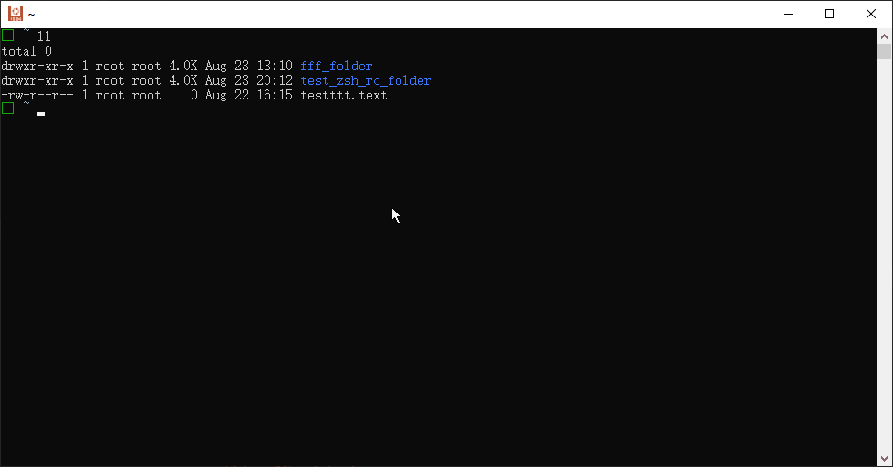

# tab-any-path

支持任何命令对于目录和文件的路径的 tab 自动补全


# Demo




# 功能

- 可以不一定是头部完全匹配, 比如 输入 `doc` 然后 tab , 可以匹配 `test_doc` 也可以匹配 `doc_test` 也可以匹配 `test_doc_test`
- 可以递归匹配当前目录的子目录的所有 `doc` 的文件/目录, 也就是说你可以在 `home` 目录输入 `cd doc` 然后从 `home` 目录一步直接 `cd` 到 `~/github/test-proj/documents` 里 !
- 如果 `cd` 后面跟的不是目录, 则自动进入到那个文件所在的目录, 比如输入 `cd ~/github/test.txt` 则可以直接进入到 `~/github` 这个文件夹里
- 不输入任何东西, tab 可直接动态搜索当前目录以及子目录的所有目录和文件


# 安装方法

1. 先安装 [fd](https://github.com/sharkdp/fd#installation).
2. 先安装 [fzf](https://github.com/junegunn/fzf#installation).
3. 然后再按照下方的[手动方式](#手动方式)或者走[Oh-My-Zsh方式](#OhMyZsh方式)的方式


## 手动方式

先克隆一波这个项目

```zsh
git clone https://github.com/no5ix/tab-any-path ~/somewhere
```

然后把下面这行加到你的 `~/.zshrc`.

```zsh
source ~/somewhere/tab-any-path.plugin.zsh
```

## OhMyZsh方式

执行下面这行命令

```zsh
git clone https://github.com/no5ix/tab-any-path ${ZSH_CUSTOM:-~/.oh-my-zsh/custom}/plugins/tab-any-path
```

1. 然后`vim ~/.zshrc`, 找到七八十行左右 `plugins=(git)` 的位置 比如原来是 `plugins=(git)` 则改为 `plugins=(git tab-any-path)`
3. `source ~/.zshrc` 或者重启 zsh


# Installation

1. Install [fd](https://github.com/sharkdp/fd) by following its [installation instruction](https://github.com/sharkdp/fd#installation).
2. Install [fzf](https://github.com/junegunn/fzf) by following its [installation instruction](https://github.com/junegunn/fzf#installation).
3. then follow [Manual](#Manual) or [Oh-My-Zsh](#OhMyZsh) below


## Manual

clone this repository.

```zsh
git clone https://github.com/no5ix/tab-any-path ~/somewhere
```

Then add the following line to your `~/.zshrc`.

```zsh
source ~/somewhere/tab-any-path.plugin.zsh
```


## OhMyZsh

Clone this repository to your custom directory and then add `tab-any-path` to your plugin list.

```zsh
git clone https://github.com/no5ix/tab-any-path ${ZSH_CUSTOM:-~/.oh-my-zsh/custom}/plugins/tab-any-path
```


# 使用方法

跟平时一样按tab就完事

实用小技巧: 

- 比如先输入 `cd` 然后 敲击 `tab` 找到想要进入的目录然后回车进入目录了, 也可以先输入 `cd doc` 然后 敲击 `tab`, 会先搜索当前目录下的匹配的文件/目录,
   - 如果只有一个匹配项, 则自动补全
      - 比如匹配到了 `Documents/` , 但如果这不是你想要的, 你想要的是 `~/github/test-proj/documents` , 那你可以再按一次tab
   - 如果不只是有一个匹配项, 则会递归搜索子目录下的所有含有 `doc` 的文件夹
- 如果输入以 `/` 结尾, 则可以只搜索一层目录, 而不是递归搜索所有子目录
- 同理 `vi`, `ln`, `mv`, `cp` 等等其他命令也是如此


# Usage

Press tab for completion as usual
