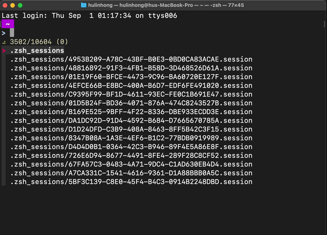

# tab-to-find

一个tab就能交互式动态搜一切 !!

并且支持命令对于任何目录和文件的路径的 tab 动态补全 

对于经常要找文件和烦恼输入非常长的路径的人来说极为好用, 不用一个路径一个路径慢慢敲了, 可以一步搜索到位, 即使有**几百万**的文件, 也非常丝滑, 丝毫不卡

简称: T T F


# Demo




# 功能

跟平时一样按tab就完事

- 不输入任何东西, tab 也可直接动态搜索当前目录以及子目录的所有目录和文件, 只是当做一个搜索工具也很好用
- tab来补全
    - 可以不一定是头部完全匹配, 比如 输入 `doc` 然后 tab , 可以匹配 `test_doc` 也可以匹配 `doc_test` 也可以匹配 `test_doc_test`
    - 可以递归匹配当前目录的子目录的所有 `doc` 的文件/目录, 也就是说你可以在 `home` 目录输入 `cd doc` 然后从 `home` 目录一步直接 `cd` 到 `~/github/test-proj/documents` 里 !
       - 如果只有一个匹配项, 则自动补全
          - 比如匹配到了 `Documents/` , 但如果这不是你想要的, 你想要的是 `~/github/test-proj/documents` , 那你可以再按一次tab
       - 如果不只是有一个匹配项, 则会递归搜索子目录下的所有含有 `doc` 的文件夹
    - 如果 `cd` 后面跟的不是目录, 则自动进入到那个文件所在的目录, 比如输入 `cd ~/github/test.txt` 则可以直接进入到 `~/github` 这个文件夹里
    - 如果输入以 `//` 结尾, 则可以只搜索一层目录的**文件夹**, 而不是递归搜索所有子目录的
    - 如果输入以 `..` 结尾, 则可以只搜索一层目录的**文件**, 而不是递归搜索所有子目录的
    - 同理 `vi`, `ln`, `mv`, `cp` 等等其他命令也是如此


# Usage

- Press tab to search everything
- Press tab for completion as usual


# 安装方法

1. 先安装fd, 按照 [fd的安装方法](https://github.com/sharkdp/fd#installation) 安装一下就行(一般来说就是一行命令就搞定), 不用额外配置
2. 再安装fzf, 按照 [fzf的安装方法](https://github.com/junegunn/fzf#installation) 安装一下就行(一般来说就是一行命令就搞定), 不用额外配置
3. 然后再按照下方的[手动方式](#手动方式) 或者 走[Oh-My-Zsh方式](#OhMyZsh方式)的方式来安装 `tab-to-find` 就可以了


## 手动方式

先克隆一波这个项目

```zsh
git clone https://github.com/no5ix/tab-to-find ~/somewhere
```

然后把下面这行加到你的 `~/.zshrc`.

```zsh
source ~/somewhere/tab-to-find.plugin.zsh
```

## OhMyZsh方式

执行下面这行命令

```zsh
git clone https://github.com/no5ix/tab-to-find ${ZSH_CUSTOM:-~/.oh-my-zsh/custom}/plugins/tab-to-find
```

1. 然后`vim ~/.zshrc`, 找到七八十行左右 `plugins=(git)` 的位置 比如原来是 `plugins=(git)` 则改为 `plugins=(git tab-to-find)`
2. `source ~/.zshrc` 或者重启 zsh


# Installation

1. Install [fd](https://github.com/sharkdp/fd) by following its [installation instruction](https://github.com/sharkdp/fd#installation).
2. Install [fzf](https://github.com/junegunn/fzf) by following its [installation instruction](https://github.com/junegunn/fzf#installation).
3. then install `tab-to-find` by following [Manual](#Manual) or [Oh-My-Zsh](#OhMyZsh) below


## Manual

clone this repository.

```zsh
git clone https://github.com/no5ix/tab-to-find ~/somewhere
```

Then add the following line to your `~/.zshrc`.

```zsh
source ~/somewhere/tab-to-find.plugin.zsh
```


## OhMyZsh

Clone this repository to your custom directory and then add `tab-to-find` to your plugin list.

```zsh
git clone https://github.com/no5ix/tab-to-find ${ZSH_CUSTOM:-~/.oh-my-zsh/custom}/plugins/tab-to-find
```


